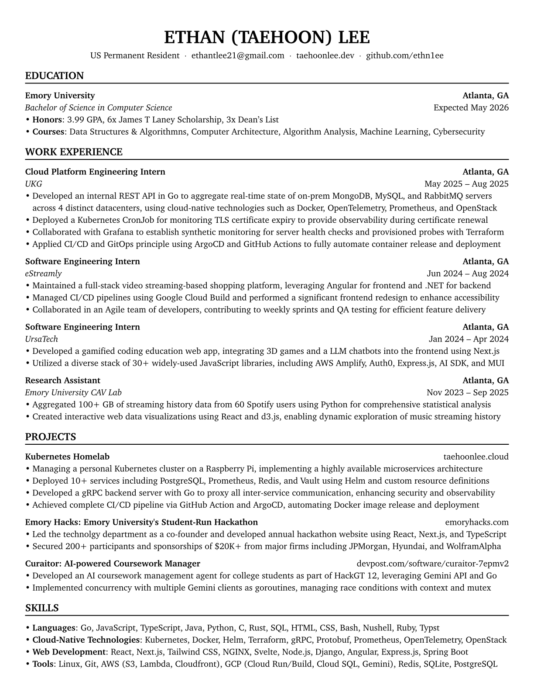

# Resume

A resume generation tool using Typst.

## Usage

1. Clone/fork this repo
2. Edit [resume.yaml](./resume.yaml) and commit
3. GitHub Action will generate the new version and create a new release
   The generated pdf and png files will also be stored in the `assets` directory
4. Download the PDF from the latest release

## Preview

Latest release: [2025-09-05-6174cdd699cf9ad18cfda626304ec553ca2850b0](https://github.com/ethn1ee/resume/releases/tag/2025-09-05-6174cdd699cf9ad18cfda626304ec553ca2850b0)
